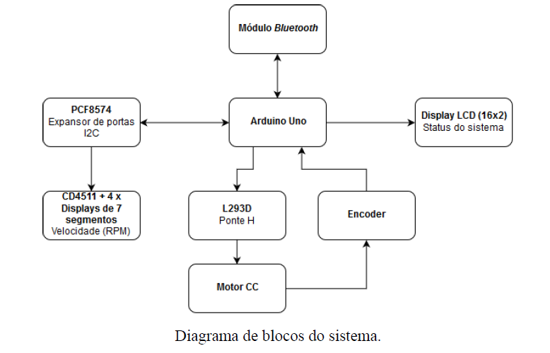
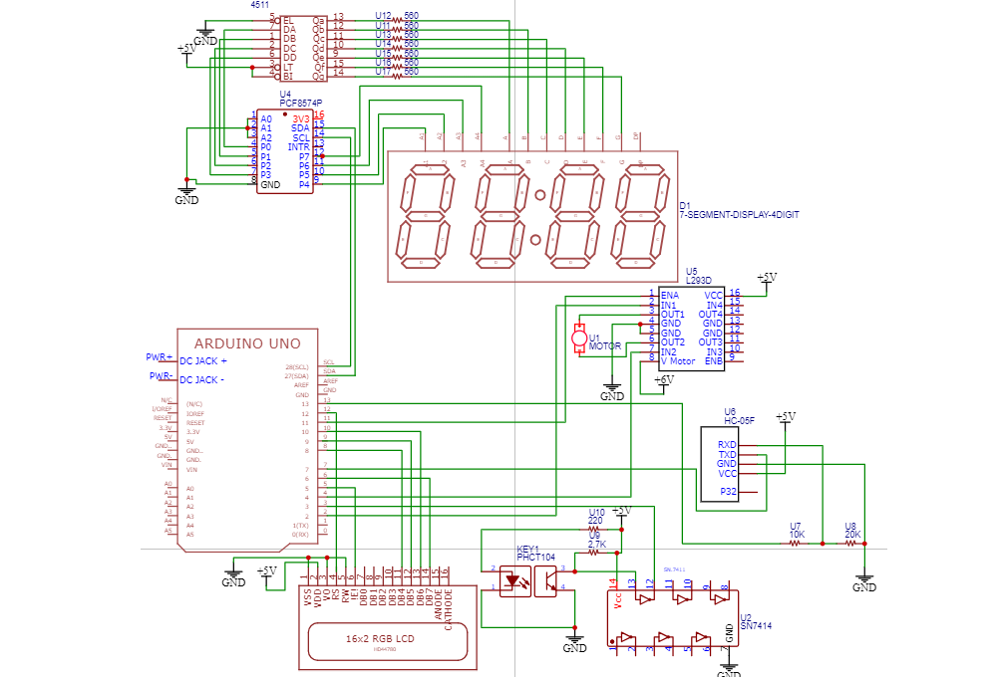

# Controle de velocidade de um motor

## Objetivo

Essa atividade foi desenvolvido para explorar as principais funcionalidade do microcontrolador ATMEGA128p. Ela foi desenvolvida através de um arduino, uma vez que facilita a comunicação entre alguns componentes,  mas também poderia ser desenvolvida partindo do microcontrolador, através de um projeto melhor elaborado. As principais funcionalidades exploradas foram:
	- Comunicação I2C;
	- Funcionamento de rotinas de interrupção;
	- Desenvolvimento com temporizadores;
	- Sistema com atuadores e sensores;
	- Comunicação via Bluetooth;
	- Multiplexação de Displays;
	- Controle PWM.

## Funcionalidades

Esse projeto originalmente se trata de uma abordagem para controlar a velocidade de um motor. Para isso, o sistema dimensionado foi desenvolvido desde a parte de leitura da velocidade do motor, até o interface para controlar sua velocidade via bluetooth ou terminal. Abaixo é possível visualizar o diagrama de bloco e o esquemático do sistema, que detalham a comunicação entre os módulos. 

Diagrama de blocos

Esquemático do sistema

A tabela abaixo exibe as opções de comandos. Caso algum comando não seja possível, o erro será tratado e o usuário é informado.

| Função | Comando| Resposta |
| ---  | ---  | --- |
| Ajuste absoluto de velocidade de x RPM para nx RPM | VEL x* |OK: VEL = x => nx RPM |
| Ajuste relativo de velocidade (y% da velocidade atual x para novo valor nx) | VREL [sinal] y*|OK: VEL = x => nx RPM |
| Ventilador | VENT* | OK: VENTILAÇÃO |
| Exaustor | EXAU*| OK: EXAUSTÃO |
| Parar | PARA* | OK: PARAR |
| Informar estimativa de velocidade (RPM) | RETV*|OK: VEL = x RPM |

Tabela de comandos

Para manter o guia sucinto, não será detalhado como cada componente foi dimensionado. 

## Observações

O controle da velocidade foi realizado tendo em vista que a tensão eficaz que advém do PWM é diretamente proporcional à velocidade do motor. Contudo, essa afirmativa pode não ser verdade dependendo do ruído causado na saída da ponte H. Sendo assim, caso o ruído apresentado seja suficiente para impedir com que a velocidade do motor seja adequada, será necessário controlar o motor por outra abordagem. Outra maneira de controlar o motor seria por alguma solução numérica, através de determinação de raízes, iterando.